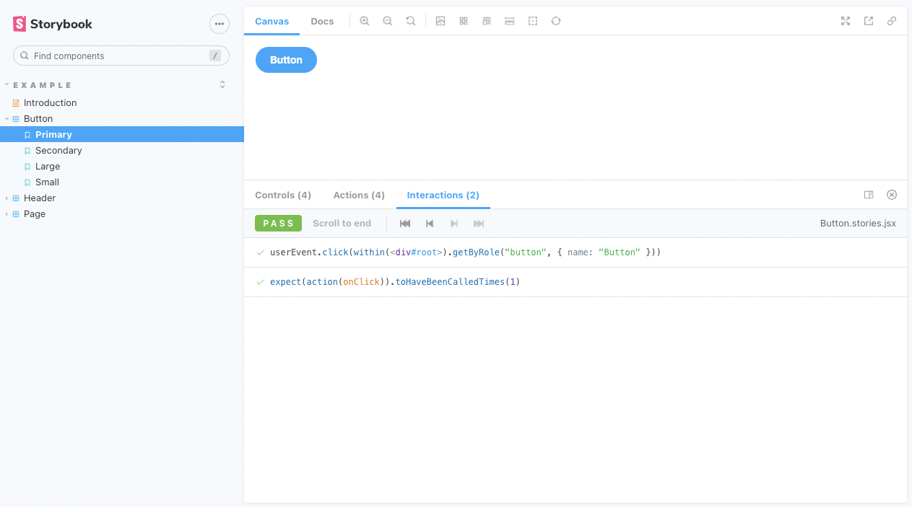
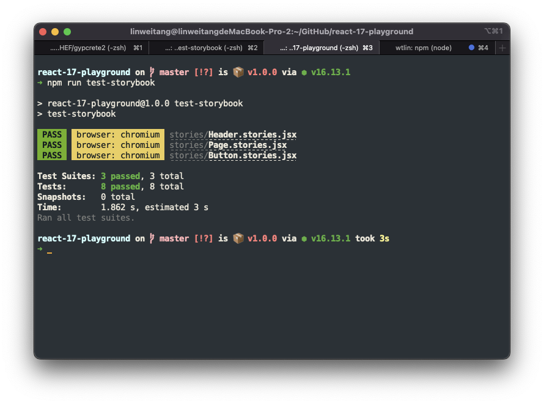

# Testing for Storybook

This repo is aim to test the interaction testing with storybook. To see if we can leverage this built-in feature to test our UI library.

## Storybook - Interactions

Run `$ npm run storybook` and open the interactions addon tab of http://localhost:6006/?path=/story/example-button--primary.



ref: https://storybook.js.org/docs/react/essentials/interactions

## Storybook - Interaction Testing

Run `$ npm run test-storybook`.



ref: https://storybook.js.org/blog/interaction-testing-with-storybook/

## Troubleshooting

### fix `test-storybook` error

If you see the following error when running `test-storybook`:

```
TypeError: Jest: Got error running globalSetup - /[root]/node_modules/@storybook/test-runner/playwright/global-setup.js, reason: Class extends value #<Object> is not a constructor or null
```

Please set the following dependencies according to this [issue#18120](https://github.com/storybookjs/storybook/issues/18120) .

```
"jest": "^27.5.1",
"jest-runner": "^27.5.1",
"jest-environment-node": "27.5.1"
```
