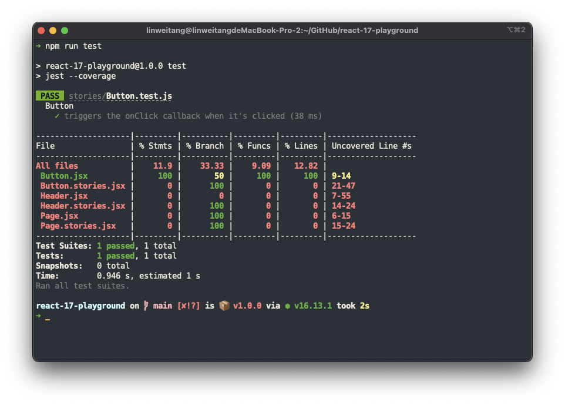

# Testing for Storybook

This repo aims to test the Interaction Testing with Storybook. To see if we can leverage this built-in feature to test our UI library.

# Conclusion

I would like to test our UI library with Storybook Interaction Testing.

The reasons are:

- We are using Storybook. The Interaction feature is amazing.
- We can play the Interactions in our Storybook directly.
- Once we are done writing the `play` function to enable Interaction. We are almost done for writing the Interaction Testing.
- The experience of writing Interaction Testing is almost the same as writing Testing Library.

The risks would be:

- Storybook Interaction Testing is in the early stage.
- We couldn't collect the testing coverage of Interaction Tests.
- What if we want to leave Storybook? We will have to unbind our tests with stories.

Is it possible to minimize the risks? Yes, it's possible. See [Minimize the risks](#minimize-the-risks)

# Survey

## Storybook - Interactions

Run `$ npm run storybook` and open the interactions addon tab of http://localhost:6006/?path=/story/example-button--primary.


ref: https://storybook.js.org/docs/react/essentials/interactions

## Storybook - Interaction Testing

Run `$ npm run test-storybook`.


ref: https://storybook.js.org/blog/interaction-testing-with-storybook/

## Troubleshooting

### fix `test-storybook` error

If you see the following error when running `test-storybook`:

```
TypeError: Jest: Got error running globalSetup - /[root]/node_modules/@storybook/test-runner/playwright/global-setup.js, reason: Class extends value #<Object> is not a constructor or null
```

Please set the following dependencies according to this [issue#18120](https://github.com/storybookjs/storybook/issues/18120) .

```
"jest": "^27.5.1",
"jest-runner": "^27.5.1",
"jest-environment-node": "27.5.1"
```

### collect test coverage

Storybook doesn't support coverage from **Interaction Testing** yet.

See https://discord.com/channels/486522875931656193/691505730125168682/965162639321882634.


`jest-playwright` does support coverage collecting with option `collectCoverage: true`. But it seems not working now.

ref: https://github.com/playwright-community/jest-playwright#:~:text=collectCoverage%20%3C%5Bboolean%5D%3E.%20Enables%20the%20coverage%20collection%20of%20the%20saveCoverage(page)%20calls%20to%20the%20.nyc_output/coverage.json%20file.

## Comparison

Constraints:

- shared UI library -> small / composable UI components
- no API request -> don't need to do mocking
- documented with storybook -> let's why I do this survey
- use chromatic -> we can play the interactions on it

| Testing Tool                  | type      | coverage | confidence          | easy to write | maintainability | happiness         |
| ----------------------------- | :-------- | :------- | :------------------ | :------------ | :-------------- | :---------------- |
| Enzyme                        | unit test | support  | 7                   | 4             | 5               | 5                 |
| Testing Library               | unit test | support  | 7                   | 8             | 7               | 8                 |
| Storybook Interaction Testing | e2e test  | N/A      | 10 (cross browsers) | 8             | 9 (GUI)         | 10 (interactions) |
| Cypress                       | e2e test  | support  | 10 (cross browsers) | 6             | 9 (GUI)         | 8                 |

### Enzyme

Enzyme is useful to test component as a unit. But our target is a shared UI library. So I prefer to ignore the implementation details.

It is a bit slow to update.

### Testing Library

React-testing-library is officially recommended by react.

Avoid testing the implementation details. See [Why is testing implementation details bad?](https://kentcdodds.com/blog/testing-implementation-details#why-is-testing-implementation-detailsbad)

### Storybook Interaction Testing

Powered by Jest, Playwright, and Testing Library.

The test writing experience is almost the same as using the Testing Library.

### Cypress

Maybe it's the most popular e2e testing framework now.

## How do other UI libraries test their components?

### Material UI

Migration from Enzyme to Testing Library since `v5.0.0`.

Use `playwright` as its e2e test framework.

### Ant Design

Recommend using Testing Library on [Ant Design Pro](https://pro.ant.design/docs/test/).

Use `puppeteer` to write e2e tests.

# Minimize the risks

Here comes my first approach. 🧐

Maybe we can extract the assertions and run them in both Storybook and Jest. Then we can:

- Enable the Storybook Interaction features
- Collect testing coverage with Jest
- Lower the pain of migrating to other tools like Storybook

There are three things to deal with:

1. Storybook selects the `canvas` with `within` API where Testing Library usually uses the `screen` directly.

   We can use dependency injection to inject `screen` into our extracted assertions.

2. Storybook uses `@storybook/testing-library` instead of `@testing-library`.

   We can simply use `@storybook/testing-library` since it just re-exports `@testing-library/dom` and `@testing-library/user-event` with some additional instructions.

   See https://github.com/storybookjs/testing-library/blob/main/src/index.ts

3. Storybook uses `expect` exported from `@storybook/jest`

   We can simply use the `export` of `@storybook/jest` since it just re-exports the `expect` with some additional instructions.

## Centralize our test utils

Re-export everything that will be used in extracted assertions.

```js
// test-utils/testing-library.js

export { expect } from "@storybook/jest";
export * from "@storybook/testing-library";
```

## Extract shared assertions

`screen` is the canvas element in Storybook or the `document.body` in Jest usually.

```js
// extracted-assertions/button.js

import { expect, userEvent, waitFor } from "../test-utils/testing-library";

export const assertButtonIsClicked = async ({ args, screen }) => {
  await userEvent.click(screen.getByRole("button", { name: "Button" }));
  await waitFor(() => expect(args.onClick).toHaveBeenCalledTimes(1));
};
```

ref:

- https://testing-library.com/docs/queries/about/#screen

## Use the shared assertions

Use the assertion in both Storybook and Jest.

```js
// stories/Button.stories.jsx

Primary.play = async ({ args, canvasElement }) => {
  const canvas = within(canvasElement);
  await assertButtonIsClicked({ args, screen: canvas });
};
```

```js
// stories/Button.test.js

describe("Button", () => {
  it("triggers the onClick callback when it's clicked", async () => {
    const props = {
      label: "Button",
      onClick: jest.fn(),
    };

    render(<Button {...props} />);

    await assertButtonIsClicked({ args: props, screen });
  });
});
```

## The Interactions should work in Storybook

`$ npm run storybook`

🎉🎉🎉


## The Interaction Testing should work

`$ npm run test-storybook`

🎉🎉🎉


## The coverage should be collected by Jest

`$ npm run test`

🎉🎉🎉


